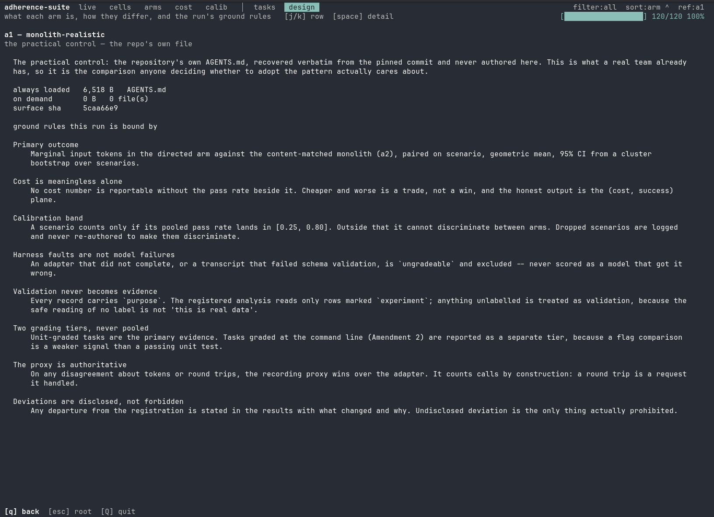
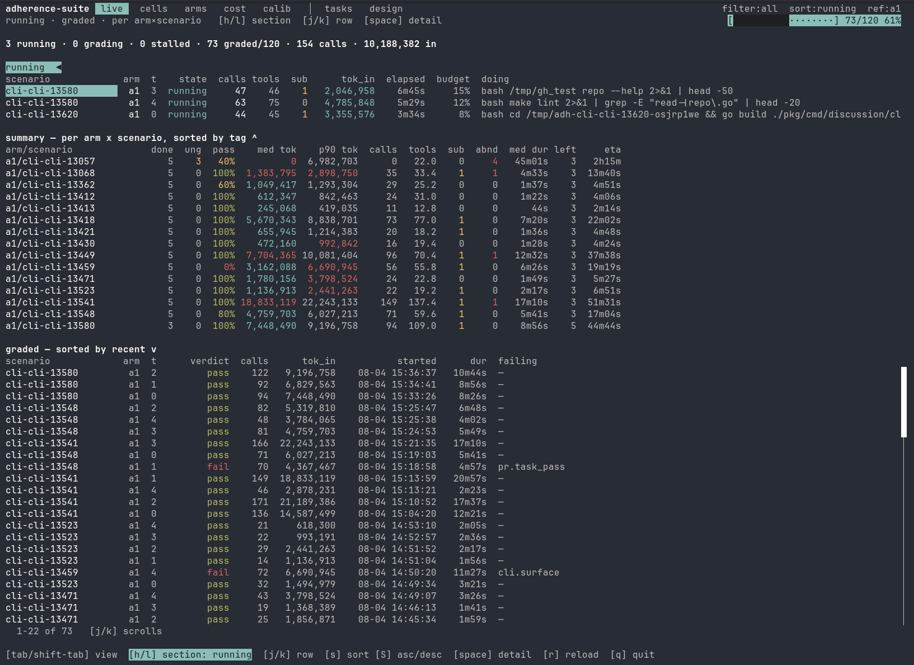
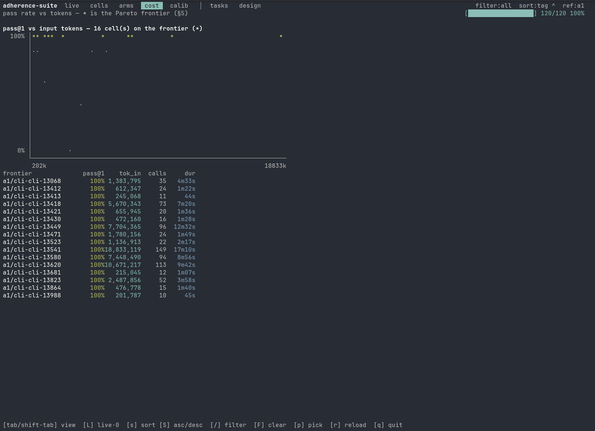
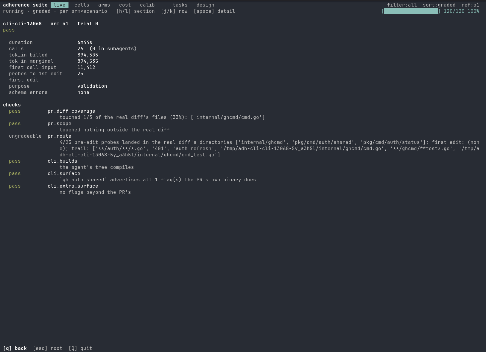
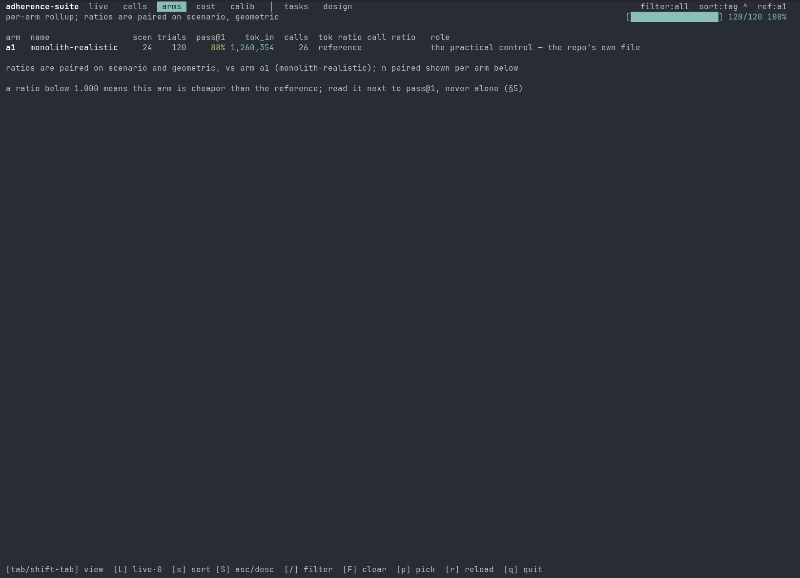

# Validation grid — 120 runs, single arm

**This is method validation. It is not experiment data and must never be
reported as a result.**

Every row carries `purpose: validation`. The registered analysis reads only
rows marked `experiment`, so nothing here can leak into a finding by accident.
The question this grid answers is not *"does the directed-contexts pattern
work"* — only one arm ran. It is *"can this fixture supply tasks that
discriminate between arms at all, and does the instrument measure them
honestly."*



*The rules this grid is bound by, read off disk rather than off a document —
`[design]`. Four of them decide what follows: cost is meaningless without the
pass rate beside it, the calibration band is `[0.25, 0.80]`, harness faults are
never model failures, and validation never becomes evidence.*

---

## 1. What ran

| | |
|---|---|
| Batch | `runs/probe.jsonl`, 120 rows, complete |
| Suite commit | `1c573d7`, clean tree (`suite_dirty: false`) |
| Arm | `a1` only — the practical control, the repo's own `AGENTS.md` |
| Fixture | `cli-cli` at base `3c162a78` |
| Scenarios | 24, five trials each |
| Model | `local/qwen36-35b-a3b-nvfp4` |
| Harness | `opencode 1.18.10` via `adapters/opencode.sh`, Python 3.14.6 |
| Concurrency | `--jobs 3`, `--timeout 2700`, `--idle-timeout 300` |
| Window | 2026-08-04 20:27:11Z → 23:40:16Z (last start) |
| Integrity | `arm_sha df9a4467`, `scenario_sha eae60fa7` |

Cost: 370,649,394 prompt tokens billed, 1,768,053 completion, 11.8 h of summed
trial duration across three workers. Median trial 161 s; longest 2,701 s — the
hard ceiling, which matters below.



*The grid in flight at 73/120. Three workers, one row each, with the command
each is executing; the per-cell rollup beneath; graded results newest-first.
`0 stalled` is a rendered state, not an absence — a hung worker would appear
here rather than silently vanish.*

---

## 2. Headline

**6 scenarios land in the calibration band `[0.25, 0.80]`, against
`MIN_PAIRED = 4`. The band requirement is met.**

Split by grading tier, which Amendment 2 requires be reported separately and
never pooled:

| Tier | In band | Scenarios | Rate |
|---|---|---|---|
| **unit** — primary evidence | **5** | 9 | 56% |
| **cli** — Amendment 2 tier | **1** | 15 | 7% |
| total | **6** | 24 | 25% |

**The unit tier clears the threshold on its own** (5 ≥ 4). That is the result
that matters, because a passing unit test is a stronger signal than a flag
comparison and the registration treats the tiers as different evidence.

**The CLI tier does not discriminate.** Eleven of fifteen cli-graded scenarios
sit at 100%. A grader that everything passes cannot separate arms, whatever its
other virtues.



*The ceiling, rendered. Sixteen cells on the Pareto frontier and **every one of
them at 100%**, spread across a 93× range of input tokens — 202k to 18,833k.
When the quality axis is pinned, the frontier degenerates into "whichever was
cheapest," and cost stops being a trade-off against anything. This is the
single clearest argument for treating the CLI tier as secondary.*

---

## 3. Per-scenario results

Pass rates are over **gradeable** trials — rows excluded as harness faults are
not counted as failures. See §5, where that was not always true.

| Scenario | Grader | Graded | Pass | Band | Abandons |
|---|---|---|---|---|---|
| cli-cli-13057 | cli | 2 | 100% | | 4 |
| cli-cli-13068 | cli | 5 | 100% | | 1 |
| cli-cli-13362 | unit | 5 | 60% | **IN** | 0 |
| cli-cli-13412 | cli | 5 | 100% | | 0 |
| cli-cli-13413 | unit | 5 | 100% | | 0 |
| cli-cli-13418 | cli | 5 | 100% | | 0 |
| cli-cli-13421 | cli | 5 | 100% | | 0 |
| cli-cli-13430 | cli | 5 | 100% | | 0 |
| cli-cli-13449 | cli | 5 | 100% | | 1 |
| cli-cli-13459 | cli | 5 | 0% | | 0 |
| cli-cli-13471 | cli | 5 | 100% | | 0 |
| cli-cli-13523 | cli | 5 | 100% | | 0 |
| cli-cli-13541 | cli | 5 | 100% | | 1 |
| cli-cli-13548 | unit | 5 | 80% | **IN** | 0 |
| cli-cli-13580 | cli | 5 | 100% | | 0 |
| cli-cli-13620 | cli | 5 | 100% | | 0 |
| cli-cli-13681 | unit | 5 | 100% | | 0 |
| cli-cli-13722 | unit | 5 | 80% | **IN** | 0 |
| cli-cli-13723 | unit | 5 | 40% | **IN** | 0 |
| cli-cli-13807 | cli | 5 | 80% | **IN** | 0 |
| cli-cli-13823 | cli | 5 | 100% | | 0 |
| cli-cli-13864 | unit | 5 | 100% | | 0 |
| cli-cli-13987 | unit | 5 | 80% | **IN** | 0 |
| cli-cli-13988 | unit | 5 | 100% | | 0 |

Exclusions applied per `docs/EVAL.md` criteria 1–2: **3 rows** for adapter
failure, 0 for schema violations. 117 of 120 rows are gradeable.

Failing checks across the grid: `pr.task_pass` ×8, `cli.surface` ×5,
`pr.diff_coverage` ×2, `cli.builds` ×1. Seven rows abandoned.
Fifty-nine of 120 rows spawned subagents, consuming 24,125,708 input tokens
that the parent stream does not carry.


*One cell opened with `[space]`. Two things to notice. The p90/median column
flags a 2.1× token tail in red — a median that looks cheap while the tail runs
away is not cheap. And there are **two** token medians: 1,383,795 over passing
trials against 1,902,217 over trials that actually worked, because the one
abandoned trial spends a fraction of a real attempt and drags the headline
number down. Reporting a single median here would understate cost by 27%.*

---

## 4. H4 — proxy vs adapter calibration

**The gate FAILS as specified, and the failure is entirely localized.**

| Set | Aggregate delta | Worst run | Calls a/p | Gate |
|---|---|---|---|---|
| All 120 rows | 19.571% | 100.00% | 5319 / 6090 | **FAIL** |
| 117 gradeable | 9.484% | 87.48% | 5319 / 5646 | **FAIL** |

Tolerance is 2% on aggregate, 2% on every run, and exact equality on call
counts. But the per-scenario view is the one that explains it:

| | |
|---|---|
| Scenarios agreeing **exactly** — 0.0% tokens *and* identical call counts | **22 of 24** |
| `cli-cli-13057` | 90.7% delta; 115 adapter calls vs **846** proxy calls |
| `cli-cli-13068` | 14.3% delta; 205 vs 245 calls |

Twenty-two scenarios do not merely agree within tolerance — they agree to the
token and to the call. The adapter's instrumentation is sound.

**The mechanism is truncation, not accounting.** Three `cli-cli-13057` trials
hit the 2,700 s hard ceiling; the adapter reported **0 tokens** for each while
the proxy recorded 134–172 calls and 16–20 M tokens apiece. When a trial is
killed mid-flight its transcript is incomplete even after salvage, while the
proxy counts a round trip by construction — a request it handled. That is
exactly the asymmetry the registration anticipated when it made the proxy
authoritative.

**All six in-band scenarios show 0.0% delta and matching call counts.** The
calibration failure does not touch a single scenario the experiment would use.

**Consequences, stated plainly:**

1. Per the registered rule, cost figures come from `runs/probe.proxy.jsonl`.
   Adapter token totals are dropped from any report.
2. The gate's aggregate form is dominated by trials that are *already excluded*
   as harness faults. Computing it over the analysis set rather than every row
   is a defensible refinement, but it is **a deviation and would have to be
   disclosed**, and it does not rescue the gate here (9.484%) — so nothing is
   gained by making it.
3. `cli-cli-13057` is unusable on both axes: 3 of 5 trials ungradeable, 4 of 5
   abandoned, and a 90.7% accounting divergence. It should be dropped from the
   fixture rather than carried.


*Why `13057` blew the ceiling, from the `[tasks]` tab — which carries no run
data at all, only what the scenario asks and how it is judged. It is a
**173-line prompt** implementing GitHub Issues 2.0 across `create`, `edit`,
`view` and `list`, closing five separate issues, touching 13 files across six
directories. This is not a task that a five-trial cell can characterize; it is
a project. The 2,700 s ceiling was not the problem — the scenario was.*

---

## 5. Defects found by this grid

The grid's other job is to break the instrument before the experiment does.
Three defects surfaced, all fixed.

### 5.1 The viewer scored harness faults as model failures — and it moved a scenario in-band

`suitedata.pass_rate` averaged over every row. An ungradeable row carries
`all_pass=False` because nothing graded it, so an adapter that hit its ceiling
counted as a model that got the task wrong — which the registration forbids in
as many words ("Harness faults are not model failures"). The registered
analysis has always applied the exclusion, so the two surfaces disagreed:

```
cli-cli-13057     viewer 40%     registered analysis 100%
```

40% is inside the calibration band. 100% is outside it. **The viewer was
inflating the count that decides whether the experiment can run.** Reported as
7 in band before the fix; 6 after.

One `_ungradeable()` predicate now feeds both the `ung` column and the rate, so
a row cannot be displayed as ungradeable and counted as a failure beside it.
Verified: the viewer and the registered analysis now agree on every cell.
Fixed in `ffa6044`.

### 5.2 The `left` column counted cells that had reported, not cells that exist

`per_cell = expect / len(cells)`, where `len(cells)` is cells that have
*produced a row*. At 86/120 that read 120/18 = 7, so every finished five-trial
cell showed two trials remaining with an ETA attached to completed work. The
estimate converges only once the last scenario starts, which is when nobody
needs it.

Now read from the batch's own recorded `argv` — the runner had already written
`--trials 5` down. The `[s] left` sort had the matching defect, ranking by time
*spent*. Fixed in `b2d1db4`.

### 5.3 The grader hole was live for this run

The suite commit (`1c573d7`) predates the fix (`df1ba6f`), so `cli-cli-13523`
was graded with no CLI surface and no unit grader — `all_pass` reduced to
"touched the right file." It reports **5/5 pass**.

**Those five rows must be discarded.** The scenario is out of band either way,
so §2's count is unaffected; dropping it makes the cli tier 1 of 14. The fix is
in the tree and `mkscenarios` now refuses such tasks at extraction, so a
re-run would not produce them.

### 5.4 A sharp edge left in place

`status: "ungradeable"` is used both for *"this check could not run"* and for
informational skips such as `cli.extra_surface`. Across the grid there are 174
checks with that status against only 3 genuinely ungradeable **rows**. Any
predicate that scans for "a check with status ungradeable" will classify all
120 rows as ungradeable — as one did while preparing this document.

The row-level definition correctly keys on the `adapter` check by name, so no
reported number is affected. Recorded because the next person to write an
ad-hoc query will hit it.



*The edge, on screen. This trial's verdict is **pass**, and one of its checks is
**ungradeable** — `pr.route`, which could not judge routing because the trail
shows no first edit to anchor on. A check that cannot run is not a row that
cannot be graded, and conflating the two classifies all 120 rows as harness
faults. Note also `purpose: validation` on the card: the guard is visible on
every single trial, not just in the file header.*

---

## 6. Instrument floors

Only `a1` ran, so the cross-arm agreement check could not execute — it needs
two arms to compare bytes-per-token rates.

| | |
|---|---|
| `a1` always-loaded surface | 6,518 B on disk |
| Per-scenario first-call input | 11,413 – 12,295 tokens |

The measured floor is stable across scenarios, which is what the check exists
to confirm. The rate cross-check must be re-run once a second arm is
materialized.

---

## 7. What this grid does and does not license

**Licensed:**

- The fixture can supply discriminating tasks. Six scenarios land in band, five
  of them unit-graded, against a threshold of four.
- The harness measures honestly on the scenarios that matter. Twenty-two of 24
  scenarios show exact adapter/proxy agreement, including all six in-band.
- The grading tiers behave as Amendment 2 predicted: unit grading
  discriminates, CLI grading ceilings.

**Not licensed:**

- **Any statement about the directed-contexts pattern.** One arm ran. There is
  no comparison here, and there is no primary outcome.



*The most honest image in this document. The arms rollup exists to show paired
geometric ratios against the reference, and here it shows **one row** — a1
compared to itself, with the ratio columns empty because there is nothing to
divide by. The 88% is a1's unweighted mean across 24 scenarios, and it is not a
finding about anything. This is what "no experiment ran" looks like when the
instrument is honest about it.*
- **Any cost figure from the adapter.** H4 failed; the proxy is authoritative.
- **Any claim that 24 scenarios is the working set.** After dropping
  `cli-cli-13523` (grader hole) and `cli-cli-13057` (unusable on two axes), the
  fixture carries 22 scenarios, 6 of them discriminating.

**Open before the experiment can run:**

1. Drop `cli-cli-13523` and `cli-cli-13057`; re-extract with the current
   `mkscenarios`.
2. Materialize arms `a0`, `a2`–`a5` and re-run `floors` for the bytes-per-token
   agreement check.
3. Decide whether to run on the unit-graded subset only. The registration
   already permits reporting the tiers separately; the cli tier's 1-of-15 rate
   is an argument for treating it as secondary rather than as evidence.
4. Re-run calibration once ceiling-hit trials are removed from the fixture, and
   confirm H4 passes on a clean grid.

---

## 8. Reproduction

```bash
# the grid, as it ran
PYTHONPATH=src python3 -m adherence.runner \
  --suite suite-pr.yaml --adapter adapters/opencode.sh \
  --model local/qwen36-35b-a3b-nvfp4 --trials 5 --arm a1 \
  --arms-dir fixtures/cli-cli.arms --out runs/probe.jsonl \
  --jobs 3 --timeout 2700 --idle-timeout 300

# the numbers in this document
PYTHONPATH=src python3 -m adherence.calibrate runs/probe.jsonl runs/probe.proxy.jsonl
PYTHONPATH=src python3 -m adherence.floors    runs/probe.jsonl --arms-dir fixtures/cli-cli.arms --ref a1
make table FILES=runs/probe.jsonl
make watch FILES=runs/probe.jsonl EXPECT=120
```

Rows are `purpose: validation`. `make analyze` will exclude all 120 by design —
that is the guard working, not a failure.
